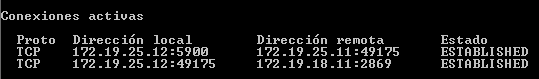
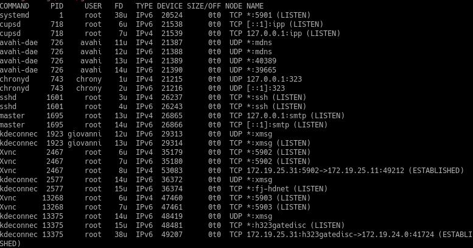
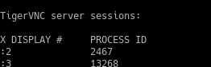
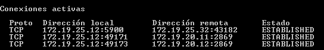

# A1 - Conexión con VNC :sparkles:

- Comprobamos Cliente Windows con Servidor Windows.
Usando el comando : 

nos aparece esta información :

- Comprobamos Cliente OpenSuse con Servidor OpenSuse.
Usando el comando :

nos aparece esta información :

 y usando
 
 nos aparece esta información :
 

 - Comprobamos Cliente OpenSuse con Servidor Windows.
 Usando el comando : 
 nos aparece esta información :
 
