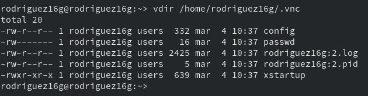
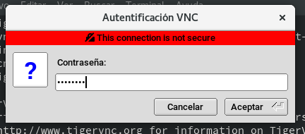

# A1 - Conexión con VNC :sparkles:
## 3. OpenSUSE: Slave VNC

Configuramos las máquinas virtuales de OpenSuse de manera que quede así: 

| MV | OS       | IP           | Rol        | Detalles              |
| -- | -------- | ------------ | ---------- | --------------------- |
| 1  | OpenSUSE | 172.19.16.31 | Slave VNC  | Instalar servidor VNC |
|  2 | OpenSUSE | 172.19.16.32 | Master VNC | Instalar cliente VNC  |

Vamos **Yast** -> **VNC**

    Permitir conexión remota. Esto configura el servicio xinet y abrimos 
puertos VNC en el cortafuegos.
    

Nos obliga a intalar los paquetes "vncmanager". Instalamos y hacemos 
reboot.

Vamos a **Yast** -> **Cortafuegos**

    Revisamos la configuración del cortafuegos.
    Debe estar permitido las conexiones a vnc-server.

Con nuestro usuario normal

    Ejecutar vncserver en el servidor para iniciar el servicio VNC. 
Ponemos claves para las conexiones VNC a nuestro escritorio.
Al final se nos muestra el número de nuestro escritorio remoto. Apuntamos 
este número porque lo usaremos más adelante.

vdir /home/nombrealumno/.vnc, vemos que se nos han creado unos ficheros 
de configuración VNC asociados a nuestro usuario.

Ejecutamos ps -ef|grep vnc para comprobar que los servicios relacionados 
con vnc están en ejecución.

Ejecutamos lsof -i -n para comprobar que están los servicios en los 
puertos VNC (580X y 590X).

### 3.1 Ir a una máquina GNU/Linux
Ejecutamos nmap -Pn IP-VNC-SERVER, desde la máquina real GNU/Linux para 
comprobar que los servicios son visibles desde fuera de la máquina 
VNC-SERVER. Deben verse los puertos VNC (5801, 5901, etc).

## 4. OpenSUSE: Master VNC

vncviewer es un cliente VNC que viene con OpenSUSE.

### 4.1 Comprobaciones finales
Comprobaciones para verificar que se han establecido las conexiones 
remotas:

Ejecutamos lsof -i -n en el servidor para comprobar las conexiones VNC.

Ejecutar vncserver -list en el servidor.

