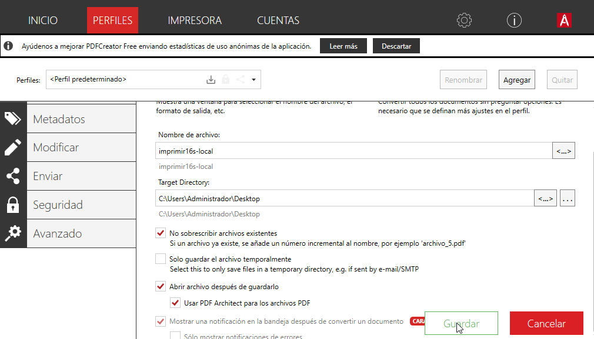
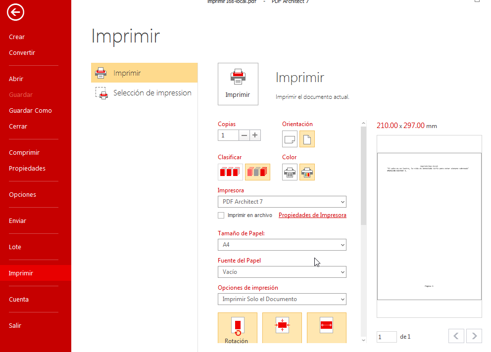
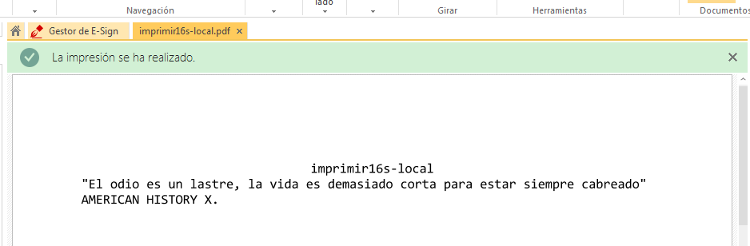
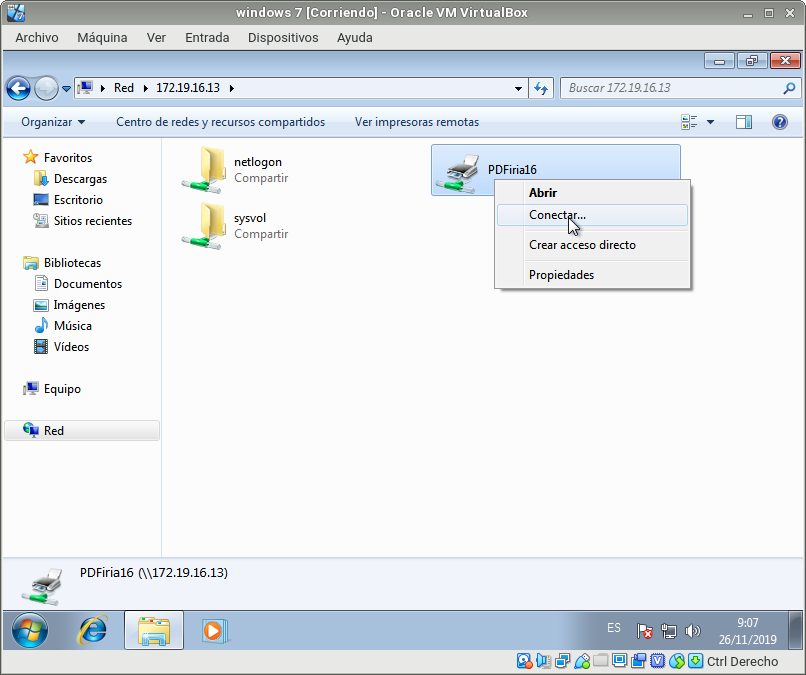
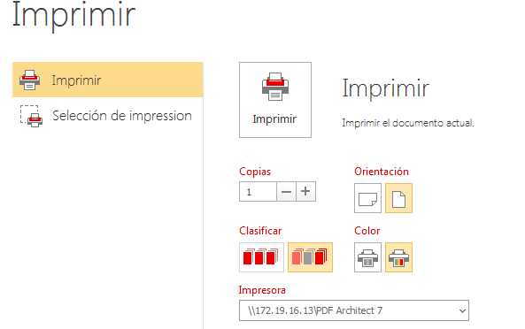
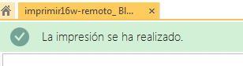
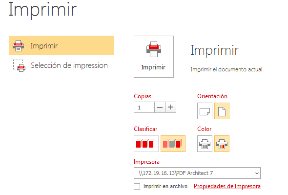
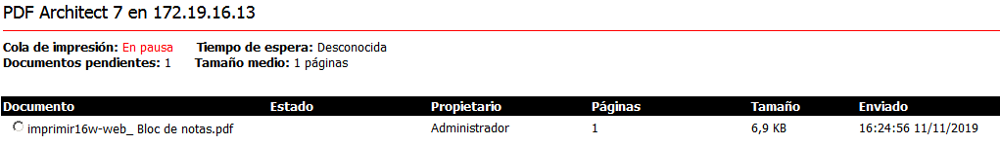
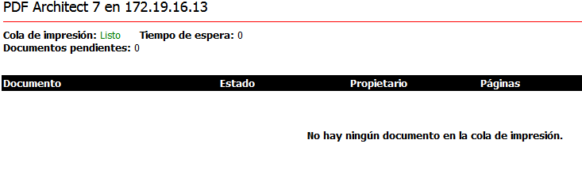
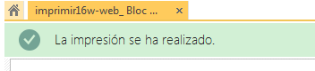

# SERVIDOR DE IMPRESIÓN DE WINDOWS  :dizzy:
>Estilo Rúbrica :

## IMPRESIÓN COMPARTIDA :pushpin:
### (1.3) Comprobar que se imprime de forma local

Para crear un archivo PDF no hará falta que cambies la aplicación que estés usando, simplemente ve a la opción de imprimir y selecciona "Impresora PDF", en segundos tendrás creado tu archivo PDF.

Puedes probar la nueva impresora abriendo el Bloc de notas y creando un fichero luego selecciona imprimir. Cuando finalice el proceso se abrirá un fichero PDF con el resultado de la impresión.

Probar la impresora remota imprimiendo documento **imprimir16s-local**:

## COMPARTIR POR RED :pushpin:
### (2.2) Comprobar desde el cliente

Vamos al cliente:

Buscar recursos de red del servidor. Si tarda en aparecer ponemos \\ip-del-servidor en la barra de navegación.

*Seleccionar impresora -> botón derecho -> conectar.*

Ponemos usuario/clave del Windows Server.
Ya tenemos la impresora remota configurada en el cliente.
Probar la impresora remota imprimiendo documento **imprimir16w-remoto.**

## ACCESO WEB :pushpin:
### (3.3) Comprobar desde el navegador

Vamos a realizar seguidamente una prueba sencilla en tu impresora de red:

Accede a la configuración de la impresora a través del navegador.

Poner en pausa los trabajos de impresión de la impresora.

Ir a MV cliente.

Probar la impresora remota imprimiendo documento **imprimir16w-web**.

Comprobar que al estar la impresora en pausa, el trabajo aparece en cola de impresión.
Finalmente pulsa en reanudar el trabajo para que tu documento se convierta a PDF.
Si tenemos problemas para que aparezca el PDF en el servidor, iniciar el programa PDFCreator y esperar un poco.

