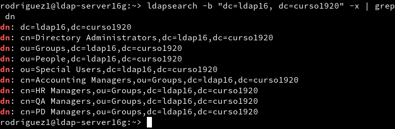
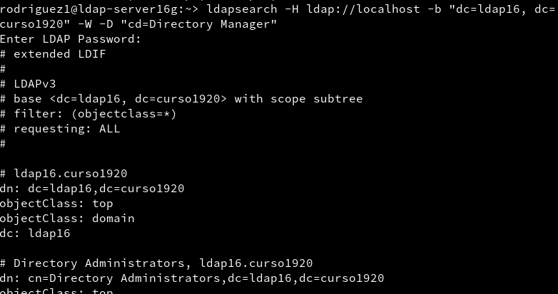
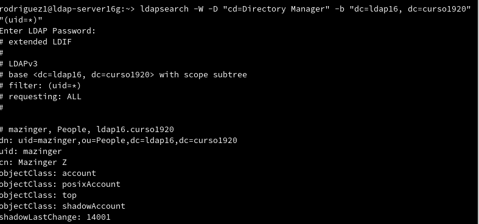
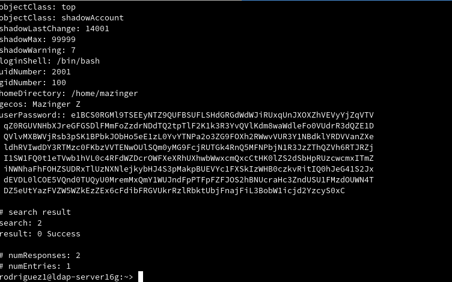
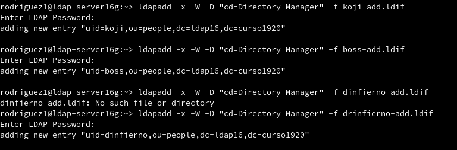
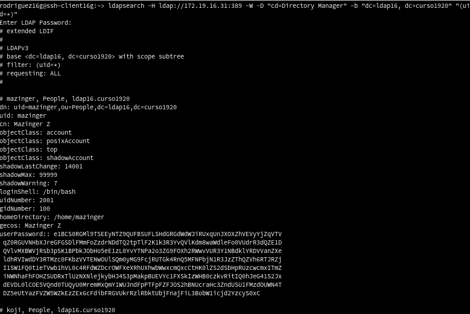
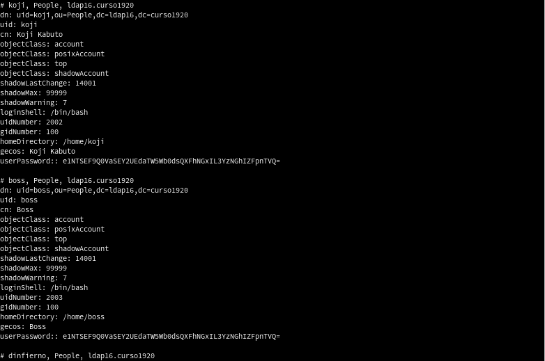

# Servicio de Directorio con comandos :dizzy:

## Entrega

Ejemplo de rúbrica:

| Sección | Muy bien (2) | Regular (1) | Poco adecuado (0) |
| ------- | ------------ | ----------- | ----------------- |
| (2.3) Comprobar contenido del DS LDAP | | | |
| (3.3) Comprobar nuevo usuario | | | |
| (4.3) Comprobar los usuarios creado | | | .|

---

## 2.3 Comprobamos el acceso al contenido del LDAP :pushpin:

* `ldapsearch -b "dc=ldapXX,dc=curso1920" -x | grep dn`, muestra el contenido de nuestra base de datos LDAP.
* Comprobar que existen las OU Groups y People.
* `ldapsearch -H ldap://localhost -b "dc=ldapXX,dc=curso1920" -W -D "cn=Directory Manager" | grep dn`, en este caso hacemos la consulta usando usuario/clave.

| Parámetro                   | Descripción                |
| --------------------------- | -------------------------- |
| -x                          | No se valida usuario/clave |
| -b "dc=ldap42,dc=curso1920" | Base/sufijo del contenido  |
| -H ldap://localhost:389     | IP:puerto del servidor     |
| -W                          | Se solicita contraseña     |
| -D "cn=Directory Manager"   | Usuario del LDAP      






---
## 3.3 Comprobar el nuevo usuario :pushpin:

* `ldapsearch -W -D "cn=Directory Manager" -b "dc=ldapXX,dc=curso1920" "(uid=*)"`, para comprobar si se ha creado el usuario en el LDAP.

Estamos usando la clase `posixAccount`, para almacenar usuarios dentro de un directorio LDAP. Dicha clase posee el atributo `uid`.
Por tanto, para listar los usuarios de un directorio, podemos filtrar por `"(uid=*)"`.

> **Eliminar usuario del árbol del directorio**
>
> * Crear un archivo `mazinger-delete.ldif`:
>
> ```
> dn: uid=mazinger,ou=people,dc=ldapXX,dc=curso1920
> changetype: delete
> ```
>
> * Ejecutamos el siguiente comando para eliminar un usuario del árbol LDAP: `ldapmodify -x -D "cn=Directory Manager" -W -f mazinger-delete.ldif`




---


## 4.3 Comprobar los usuarios creados :pushpin:

* Ir a la MV cliente LDAP.
* Ejecutar comando `ldpasearch ... "(uid=*)" | grep dn` para consultar los usuarios LDAP en el servidor de directorios remoto.







---
