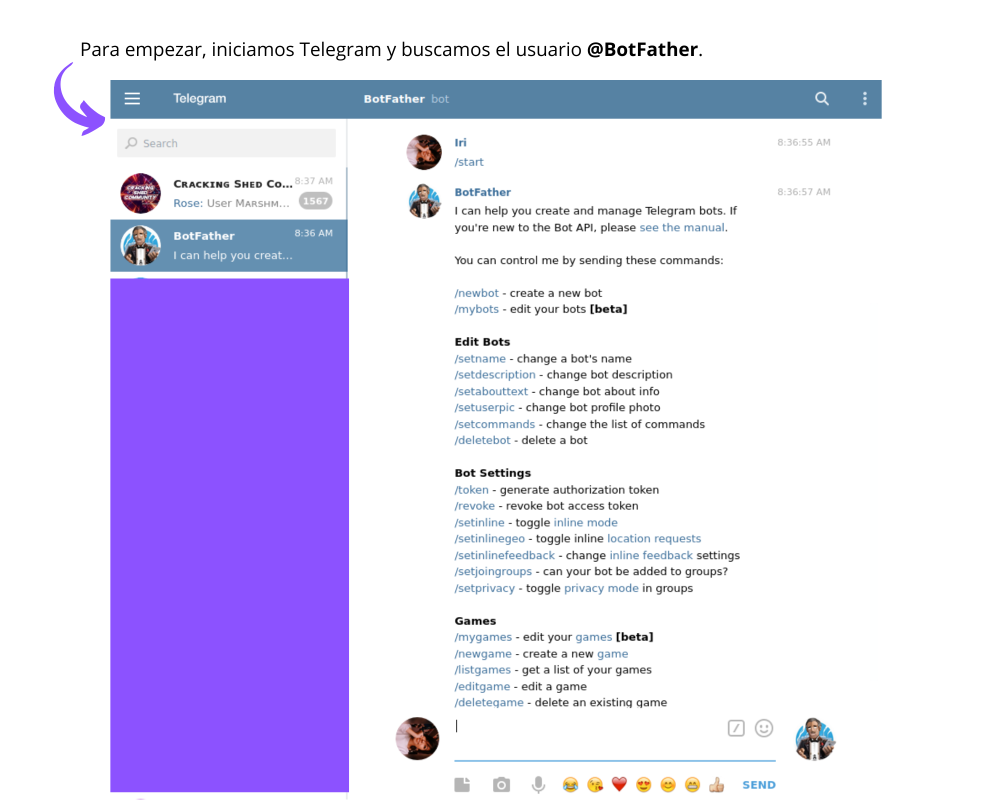
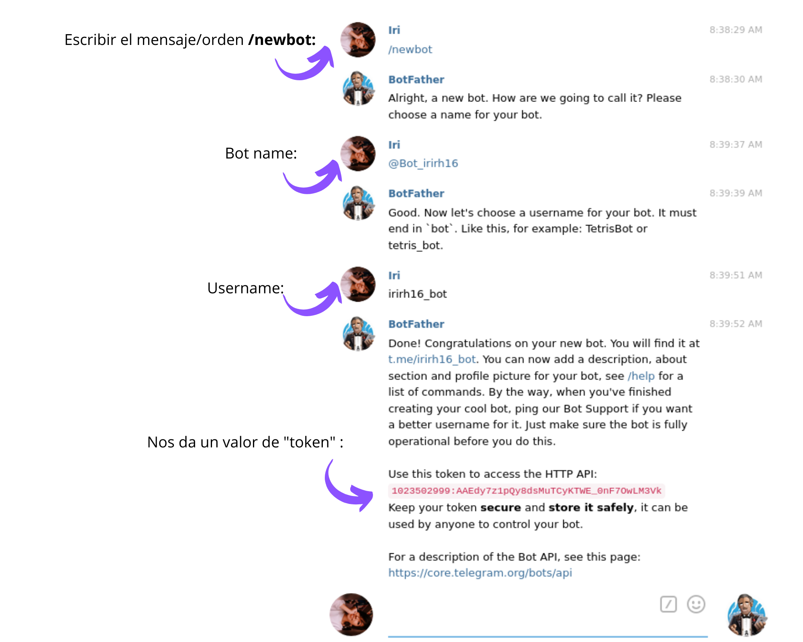
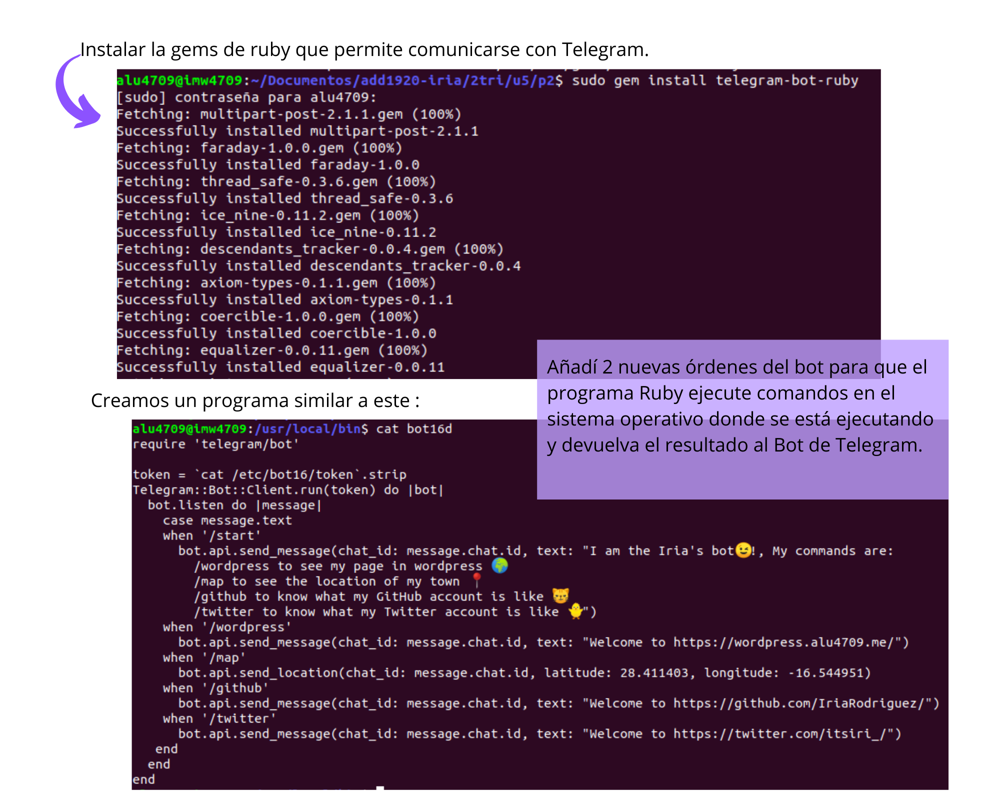
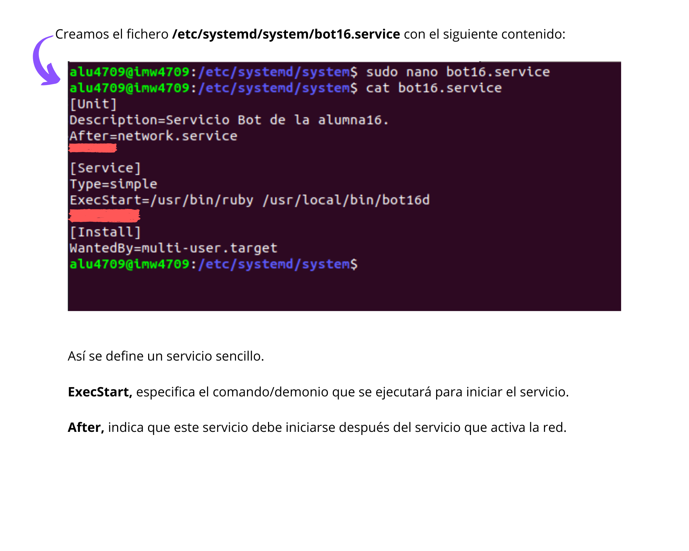
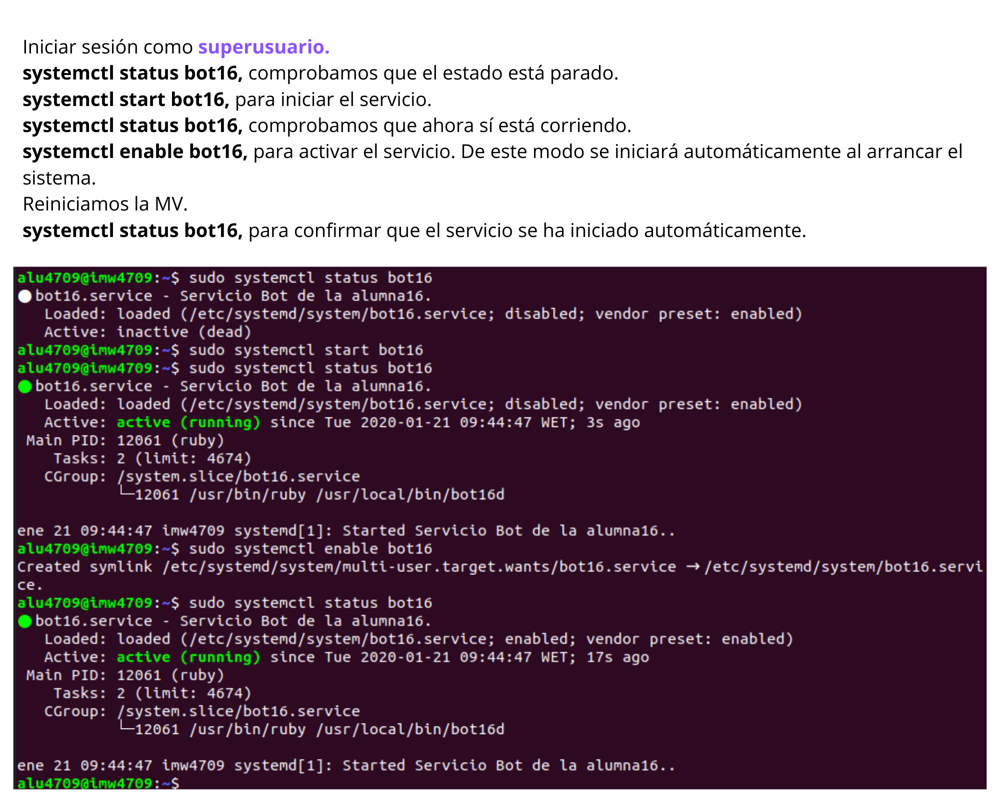
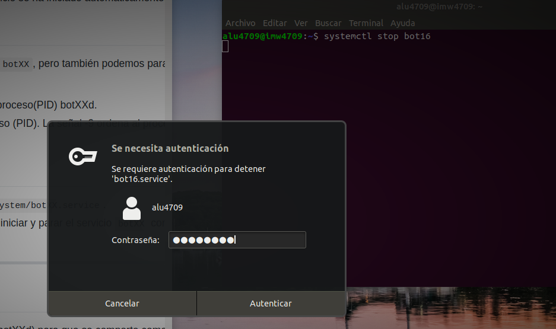
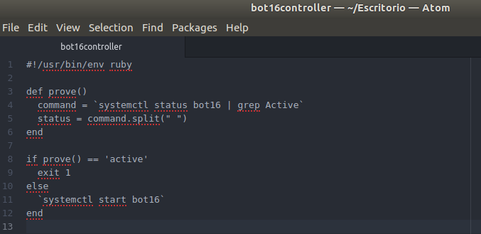
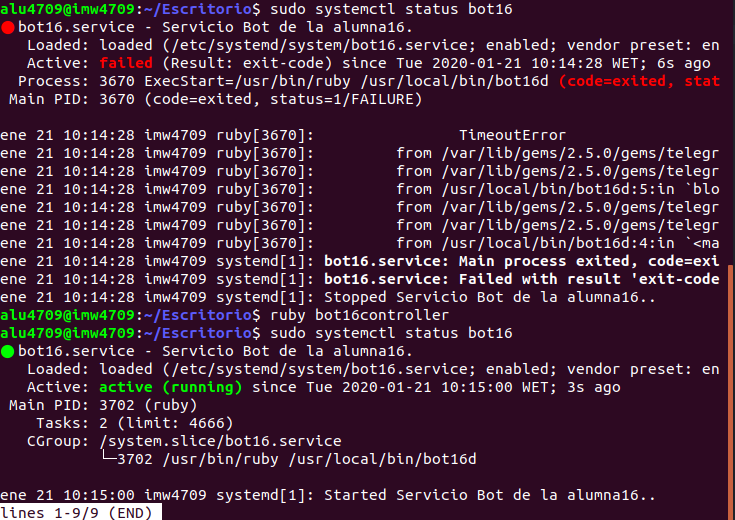
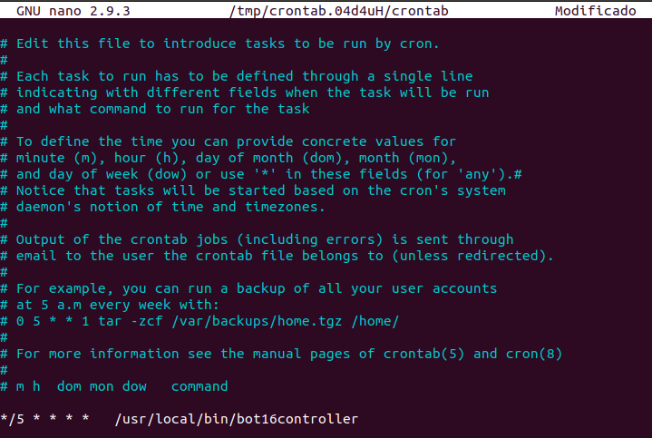
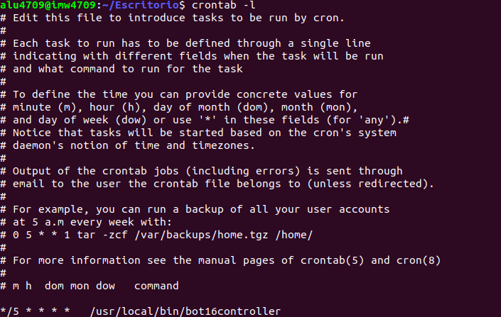

# Servicio de comunicaciones con Telegram (bot-service).  :dizzy:

Vamos a crear un servicio de Systemd que iniciará un Bot de Telegram.

##  :star: 1. Crear un bot de Telegram con ruby.
### Crear bot con BotFather y programa de ruby.

 :fast_forward: :fast_forward: [Script del bot](https://github.com/IriaRodriguez/add1920-iria/blob/master/2tri/u5/p2/bot16d)

##  :star: 2. Systemd

Vamos a crear un servicio para nuestro bot, de modo que se inicie siempre al arrancar el equipo y que podemos gestionarlo como el resto de servicios (usando el comando systemctl).
### Crear un servicio
Vamos a usar el script demonio, creado en el apartado anterior. Un demonio (daemon) es un programa que se ejecuta en segundo plano permanentemente para dar algún servicio.

El init es el proceso que inicia todo el sistema y arranca los servicios. Cada sistema operativo puede tener distintos "init" como Systemd, SystemV, Upstart, Openrc, etc. Nuestro sistema operativo viene con Systemd, así vamos a configurar Systemd para gestionar nuestro servicio.

Cada servicio de Systemd se define en un fichero ***Unit file***

### Iniciar y activar el servicio

### Parar el proceso
Lo más cómodo para parar el servicio es systemctl stop bot16, pero también podemos parar el servicio bot16 "matando" el programa bot16d. Veamos como:

    ps -ef | grep bot16d, localizar el identificador del proceso(PID) bot16d.

    kill -9 PID, emitimos una señal/orden (-9) al proceso (PID). La señal -9 ordena al proceso que "muera" (que se cierre).

 :fast_forward: :fast_forward: [Bot service](https://github.com/IriaRodriguez/add1920-iria/blob/master/2tri/u5/p2/bot16.service)

##  :star: 3. Programar tareas

Ya sabemos como configurar nuestro programa demonio (botXXd) para que se comporte como un servicio, y además para que se inicie de forma automática al iniciar la máquina.

Supongamos que nos preocupa que nuestro programa (botXXd) se pueda detener de forma inesperada y no nos demos cuenta. Vamos a crear otro script que se va a encargar de iniciar el demonio si se para. Este script va a controlar el demonio cada 5 minutos.

### Controlador
Creamos un nuevo script */usr/local/bin/bot16controller*. Este script hará lo siguiente:

Consulta si el demonio está en ejecución. Se puede hacer con:

       ps -ef |grep bot16d o
        systemctl is-active bot16 o systemctl status bot16
        etc.

Si el servicio no está en ejecución, entonces:

        Se inicia el servicio (systemctl ...).

        Se registra el siguiente mensaje en el fichero de log (/etc/bot16/log): "[bot16controller] Iniciando el servicio del bot..."

Si el servico está en ejecución, entonces registramos el siguiente mensaje en el fichero de log (/etc/bot16/log): "[bot16controller] No hace nada!".

Se termina el script.

### Tareas programadas
Vamos a programar el script bot16controller para que se ejecute cada 5 minutos. Usaremos la herramienta crontab.

Iniciar sesión con el usuario root.

crontab -l, vemos que no hay ninguna configuración creada.

crontab -e, se nos abre un editor.

Pulsar i(insert) para activar el modo de empezar a escribir.

    Información para configurar crontab:

        m: minuto
        h: hora
        mon: mes
        dow: día del mes
        dom: día de la semana (0=domingo, 1=lunes, etc)
        Comando a ejecutar

Escribir algo parecido a lo siguiente:

        */5 * * * *   /usr/local/bin/botXXcontroller

 :fast_forward: :fast_forward: [Bot controller](https://github.com/IriaRodriguez/add1920-iria/blob/master/2tri/u5/p2/bot16controller)
