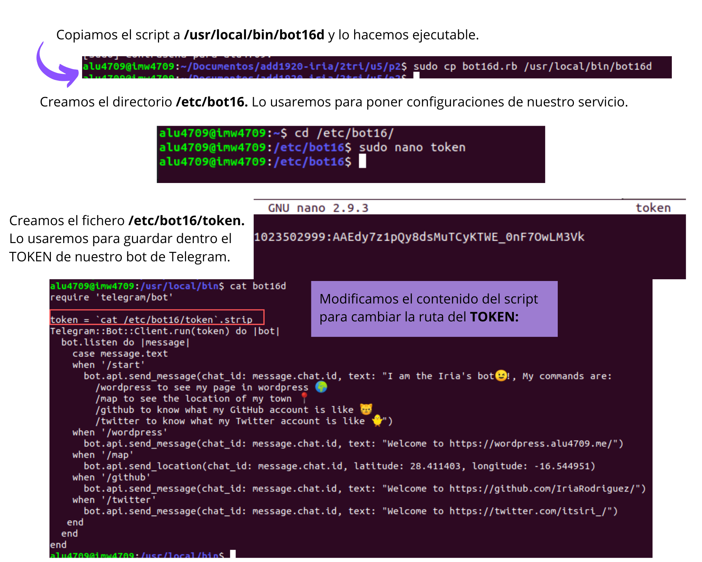

# Servicio de comunicaciones con Telegram (bot-service).  :dizzy:

Vamos a crear un servicio de Systemd que iniciará un Bot de Telegram.

##  :star: 1. Crear un bot de Telegram con ruby.
### Crear bot con BotFather y programa de ruby.

