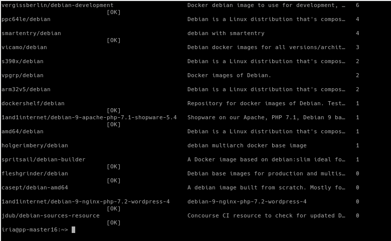
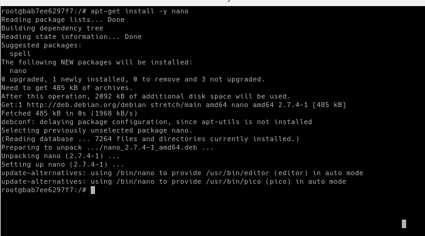

# UT6-A3: Contenedores con Docker :sparkles:

## 1. Habilitar el acceso a la red externa a los contenedores

Vamos a "YaST" > "Ajustes de red" > "Encaminamiento" y habilitamos el 
reenvío de Ipv4.

## 2. Instalación y primeras pruebas

### 2.1 Instalación

Abrimos una terminal y lanzamos "zypper in docker".

Ahora iniciamos el servicio y vemos su versión.

## 2. Creación manual

### 2.1 Crear una imagen manualmente

Vemos las imágenes que tenemos. [Todavía no tenemos ninguna.]

Buscamos en los repositorios con la etiqueta "debian".

Nos descargamos la imagen "debian9".

Ahora vemos los contenedores que están en ejecución.

Creamos un contenedor que se llame con_debian a partir de la imagen que 
acabamos de descargar y ejecutamos /bin/bash.

### 2.2 Personalizar el contenedor

Comprobamos que estamos en debian.

Actualizamos los repositorios.

Instalamos Nginx.

Instalamos el editor nano.

Iniciamos el servicio Nginx.

Lanzamos "ps -ef", vemos que no existe, lo intentamos instalar, pero no 
existe el paquete.

Luego creamos el fichero holamundo.html con nuestro nombre.

Creamos el siguiente script:

### 2.3 Crear una imagen a partir del contenedor

Creamos una nueva imagen, para ello tenemos que saber la ID del 
contenedor que ya tenemos, hacemos lo siguiente:

Ahora paramos el contenedor "con_debian", vemos que se ha parado y lo 
eliminamos.

## 3. Crear contenedor a partir de nuestra imagen

### 3.1 Crear contenedor con Nginx

Ahora creamos el contenedor con Ngnix instalado.

### 3.2 Comprobamos

Vemos todos los contenedores.

Vemos que inicia la máquina

Abrimos un navegador y vemos que funciona la página por defecto de Nginx.

### 3.3 Migrar la imágen a otra máquina

Ahora guardamos la imagen con nuestro nombre y se la pasamos a un 
compañero.

## 4. Dockerfile

### 4.1 Preparar ficheros

Creamos el directorio docker16 en nuestro home con los ficheros 
holamundo.html y server.sh creados anteriormente.

Ahora creamos el fichero Dockerfile con lo siguiente:

### 4.2 Crear imagen a partir del Dockerfile

Comprobamos que está nuestra imagen.

### 4.3 Crear contenedor y comprobar

Ahora crearemos el contenedor con la imagen anterior y abrimos un 
navegador y probamos.

Y comprobamos el fichero holamundo.html.

