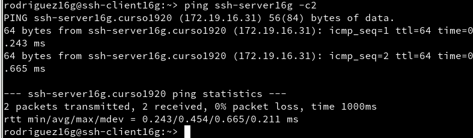
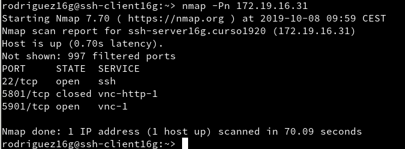
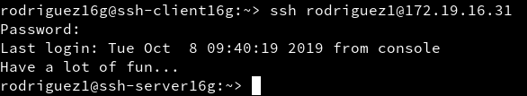
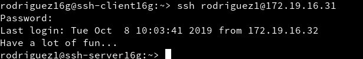
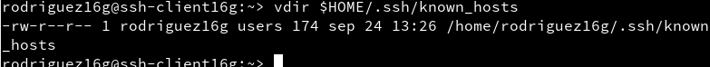
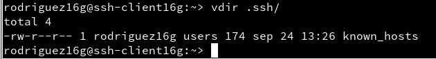
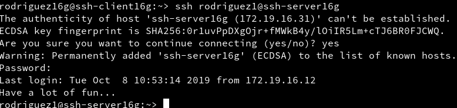
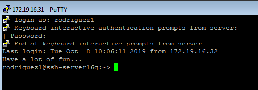

# A2 : ACCESO REMOTO CON SSH
>Estilo rúbrica. :octocat:

Teniendo en cuenta :

Función : **Un servidor SSH**  
Sistema Operativo : GNU/Linux OpenSUSE (Sin entorno gráfico)  
IP : *172.19.16.31*  
Nombre: ***ssh-server16g***

Función : **Un cliente SSH**  
Sistema Operativo :	GNU/Linux OpenSUSE31  
IP : *172.19.16.32*  
Nombre: ***ssh-client16g***

Función : **Un servidor SSH**  
Sistema Operativo : Windows Server
IP : *172.19.16.11*  
Nombre: ***ssh-server16s***

Función : **Un cliente SSH**  
Sistema Operativo :	 	Windows7
IP : *172.19.16.12*  
Nombre: ***ssh-client16w***

## (2.2) Primera conexión SSH GNU/Linux :sparkles:
- Vamos al cliente `ssh-client16g`.
- Comprobamos la conectividad con el servidor : `ping ssh-server16g`.

-  Comprobamos los puertos abiertos en el servidor (SSH debe estar **open**): `nmap -Pn ssh-server16g` (debe mostrarnos que el puerto **22** está abierto).

- Vamos a comprobar el funcionamiento de la **conexión SSH** desde cada cliente usando el usuario `rodriguez1`.
- Desde el **cliente** GNU/Linux nos conectamos mediante ssh `rodriguez1@ssh-server16g`.

- Comprobamos el contenido del fichero `$HOME/.ssh/known_hosts` en el equipo **ssh-client1**

## (3.2) Comprobamos :sparkles:
- Comprobamos qué sucede al volver a conectarnos desde los dos clientes, usando los usuarios rodriguez2 y rodriguez1.

